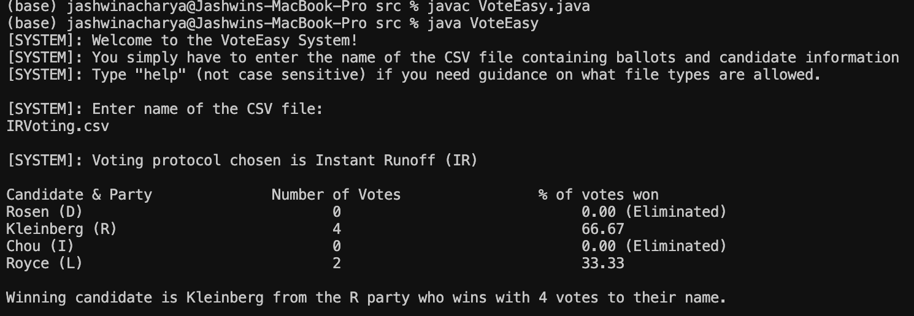
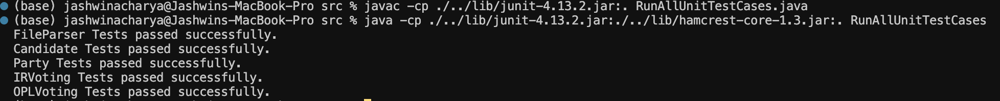
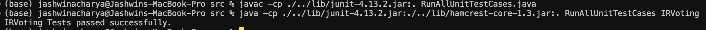

This code has been submitted by 6pm on Monday (13th November 2023).

# Running the VoteEasy System

Firstly, ensure that you have a CSV file for running OPL and/or IR voting protocols.
Navigate to the `Project1/src` folder and execute the below command for running the VoteEasy System:

Compile VoteEasy system:
```
javac VoteEasy.java
```

Run VoteEasy system:
```
java VoteEasy
```

Once you run the VoteEasy program, you will be prompted to enter the name of the CSV file containing election information. Ensure that the CSV file is present in the `Project1/src` directory before running the system.

Following is an example screenshot of running the program and providing a CSV file having "IR" or Instant Runoff as its voting protocol:



An audit file should be generated in the "src" directory called "audit_file.txt" which contains a step-by-step progression of the election.

# Running tests

Navigate to the `Project1/src` folder and execute the below command for running tests for all the classes:

Compile tests:
```
javac -cp ./../lib/junit-4.13.2.jar:. RunAllUnitTestCases.java
```

Run Tests:
```
java -cp ./../lib/junit-4.13.2.jar:./../lib/hamcrest-core-1.3.jar:. RunAllUnitTestCases
```

Example screenshot of running all the tests using the above commands:



You can also run individual tests after compiling them using the following commands:

```
java -cp ./../lib/junit-4.13.2.jar:./../lib/hamcrest-core-1.3.jar:. RunAllUnitTestCases FileParser
```

```
java -cp ./../lib/junit-4.13.2.jar:./../lib/hamcrest-core-1.3.jar:. RunAllUnitTestCases Candidate
```

```
java -cp ./../lib/junit-4.13.2.jar:./../lib/hamcrest-core-1.3.jar:. RunAllUnitTestCases Party
```

```
java -cp ./../lib/junit-4.13.2.jar:./../lib/hamcrest-core-1.3.jar:. RunAllUnitTestCases IRVoting
```

```
java -cp ./../lib/junit-4.13.2.jar:./../lib/hamcrest-core-1.3.jar:. RunAllUnitTestCases OPLVoting
```

Note: It's possible that the tests could take upto 45 seconds to run sometimes for the IRVoting and OPLVoting test classes. 

Example screenshot of running IRVoting tests using the above commands:



# Assumptions

For OPL, we assume that the quota is a whole number, so if we obtain a decimal number during our quota calculations, we round it up to the nearest whole number. We also assume that if there is a tie between any parties and their remaining votes, then we perform a "coin flip" to determine the party that gets the remaining number of seats still to be allocated.

For IR, we assume that if two candidates are tied with the lowest number of votes during redistribution, we do not perform a tie-breaker there and instead just pick the first candidate who has the lowest number of votes and redistribute their ballots. We weren't completely sure if this is an issue or not and we have recorded this as a bug in our buglist.pdf document too.